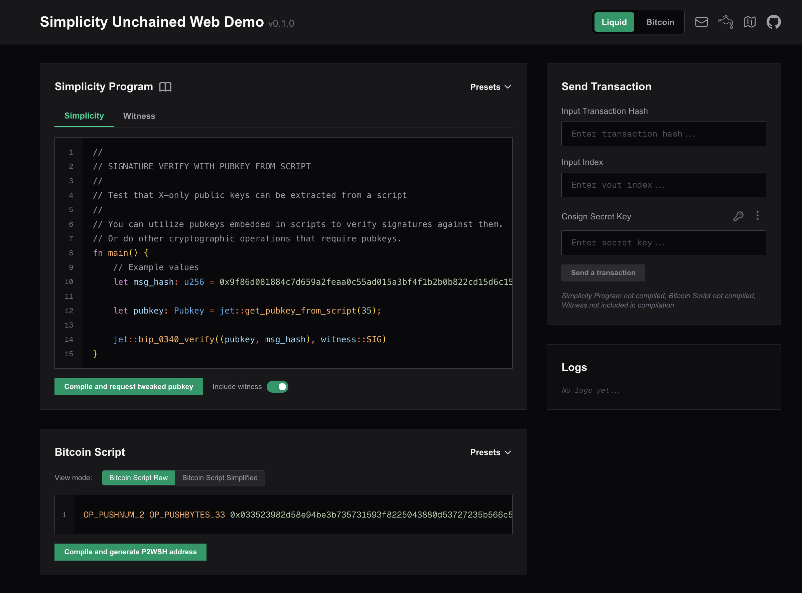

# Simplicity Unchained (Prototype Phase)

Simplicity Unchained brings [Simplicity](https://simplicity-lang.org/) to Bitcoin networks. It acts as an oracle that executes Simplicity programs and, on success, produces side effects such as co-signing Bitcoin transactions, triggering events, or performing any other action a server is capable of.

The primary target is **Bitcoin** (including Bitcoin testnets), with additional support for Elements-based networks such as Liquid.

> ⚠️ **Warning: Project Under Development**
>
> This project is still in active development and conceptualization. It is **not safe for use in production environments** at this time. Features and functionality may change, and there may be critical bugs or incomplete implementations.

## Project Structure

- [`core`](core/README.md): Contains the fundamental logic for executing Simplicity programs, interacting with Bitcoin and Elements environments and interface for loading custom jet implementations from dynamic libraries. (Note: In the future, parts of this logic may be migrated to [hal-simplicity](https://github.com/BlockstreamResearch/hal-simplicity))

- [`jet_plugins`](jet_plugins/README.md): Procedural macro for deriving Jet trait for given custom jets alongside with it's C FFI. Currently supports extending Bitcoin and Elements jets.

- [`service`](service/README.md): Implements a web service providing endpoints to interact with Simplicity Unchained. Currently, it supports a 2-of-2 multisig co-signing flow on Bitcoin and Elements, triggered by the successful execution of a Simplicity program.

- [`cli`](cli/README.md): Command-line interface for communicating with the Simplicity Unchained service and accessing various ecosystem utilities. (Note: In the future, parts of this CLI will use [hal-simplicity](https://github.com/BlockstreamResearch/hal-simplicity))

Each component of the project has its own README file with more detailed information.

## Web Demo

A live testnet demo is hosted at **[testnet.simplicity-unchained.blockstream.com](https://testnet.simplicity-unchained.blockstream.com/)**. It provides a browser interface for writing Simplicity programs, compiling them, generating a P2WSH address, and sending co-signed transactions on Bitcoin Testnet4 or Liquid Testnet — no CLI or local setup required.

## Capabilities demoed so far

### Bitcoin

You can explore the Bitcoin capabilities by running the [Bitcoin demo script](cli/scripts/demo_bitcoin.sh). This demo guides you through:

1. Tweaking a public key with a Simplicity program via the Simplicity Unchained service.
2. Creating a 2-of-2 multisig P2WSH address on Bitcoin Testnet4.
3. Funding the address and creating a PSBT spending transaction.
4. Using the Simplicity Unchained service to co-sign the PSBT after successful Simplicity program execution.
5. Broadcasting the fully signed transaction to Bitcoin Testnet4.

### Elements / Liquid

The [Elements demo script](cli/scripts/demo.sh) demonstrates the same 2-of-2 multisig co-signing flow on the Liquid Testnet.

To run either demo, follow the instructions in the [CLI readme](cli/README.md).

## Licence

See the [LICENCE](LICENCE) file for details.

## Original Idea

This project is inspired by [Smart Contracts Unchained](https://zmnscpxj.github.io/bitcoin/unchained.html), a concept proposed by ZmnSCPxj in 2019.
